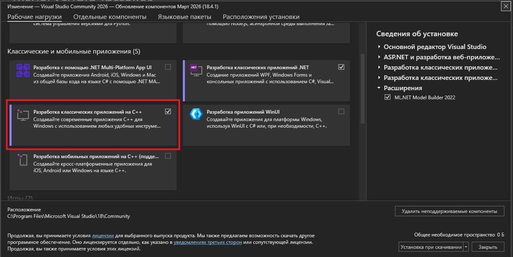
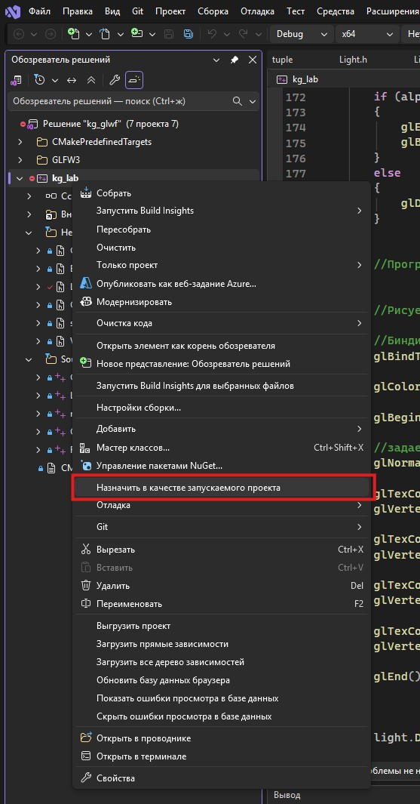

Внутри каждой папки (пока одной) лежит CMakeLists.txt
Необходимо сначала сконфигурировать проект с помощтю Cmake (который нужно установить), выполнив команду

```
cmake -B build
```

из необходимой папки. 

## Windows + Visual Studio

Для работы в Windows необходимо иметь Visual Studio с установленными компонентами для С++:



Для конфигурации проекта необходимо установить CMake

```
winget install cmake
```

Для создания проекта, необимо перейти в папку нужной лабораторной работы и сконфигурировать проект командой:

```
cmake -B build
```

<details>

```
PS C:\...\LAB2_training> cmake -B build

-- Building for: Visual Studio 18 2026
-- Selecting Windows SDK version 10.0.26100.0 to target Windows 10.0.26200.
-- The C compiler identification is MSVC 19.50.35727.0
-- The CXX compiler identification is MSVC 19.50.35727.0
-- Detecting C compiler ABI info
-- Detecting C compiler ABI info - done
-- Check for working C compiler: C:/Program Files/Microsoft Visual Studio/18/Community/VC/Tools/MSVC/14.50.35717/bin/Hostx64/x64/cl.exe - skipped
-- Detecting C compile features
-- Detecting C compile features - done
-- Detecting CXX compiler ABI info
-- Detecting CXX compiler ABI info - done
-- Check for working CXX compiler: C:/Program Files/Microsoft Visual Studio/18/Community/VC/Tools/MSVC/14.50.35717/bin/Hostx64/x64/cl.exe - skipped
-- Detecting CXX compile features
-- Detecting CXX compile features - done
-- Performing Test CMAKE_HAVE_LIBC_PTHREAD
-- Performing Test CMAKE_HAVE_LIBC_PTHREAD - Failed
-- Looking for pthread_create in pthreads
-- Looking for pthread_create in pthreads - not found
-- Looking for pthread_create in pthread
-- Looking for pthread_create in pthread - not found
-- Found Threads: TRUE
-- Including Win32 support
-- Could NOT find Doxygen (missing: DOXYGEN_EXECUTABLE)
-- Documentation generation requires Doxygen 1.9.8 or later
-- Found OpenGL: opengl32
-- Configuring done (20.0s)
-- Generating done (0.3s)
-- Build files have been written to: C:/.../LAB2_training/build

PS C:\...\LAB2_training> 

```
</details>

Cmake обнаружит необходимую версию VS, а так же компиляторы С и С++. После чего в папке build будет создано решение.

В решении будет находится несколько проектов: проекты, необходимые для сборки библиотеки GLWF, и проект для лабораторной работы kg_lab. Его необходимо сделать основным:



## Mac OS

## Linux (Ubuntu)

Для Linux и MacOs создается makefile.

Я попрошу отвественных студентов написать мне тут интсрукцию с действиями по запуску проекта на стеке, отличном от Windows-VisualStudio чтобы облегчиьт жизнь будущим поколениям.


