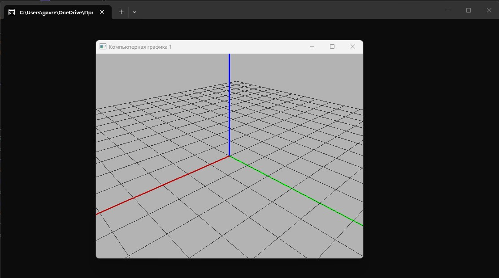
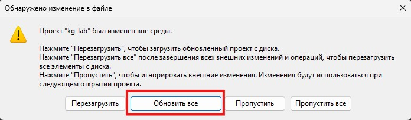

Внутри каждой папки (пока одной) лежит CMakeLists.txt
Необходимо сначала сконфигурировать проект с помощью CMake (который нужно установить), выполнив команду

```bash
cmake -B build
```

В папке build будут созданы материалы для компиляции в зависимости от ОС и установленных средств разработки.

Сборку можно также произвести через CMake (по факту CMake ничего не собирает, а управляет тем, что установлено):

```
cmake --build build
```

Скомпилированная программа может располагаться в папке build, build/Debug, и т.д., в зависимости от сборщика.

Ниже инструкции для сборки шаблонов в зависимости от операционных систем.

### Содержание

- [Windows + Visual Studio](#windows--visual-studio)
- [Mac OS](#mac-os)
- [Linux](#linux)

## Windows + Visual Studio

Для работы в Windows необходимо иметь Visual Studio с установленными компонентами для С++:


Для конфигурации проекта необходимо установить CMake

```powershell
PS > winget install cmake
```

Для создания проекта, необходимо перейти в папку нужной лабораторной работы и сконфигурировать проект командой:

```powershell
PS > cmake -B build
```

<details>

<summary>Полный вывод команды при корректной работе CMake</summary>

```powershell
PS C:\...\LAB2_training> cmake -B build

-- Building for: Visual Studio 18 2026
-- Selecting Windows SDK version 10.0.26100.0 to target Windows 10.0.26200.
-- The C compiler identification is MSVC 19.50.35727.0
-- The CXX compiler identification is MSVC 19.50.35727.0
-- Detecting C compiler ABI info
-- Detecting C compiler ABI info - done
-- Check for working C compiler: C:/Program Files/Microsoft Visual Studio/18/Community/VC/Tools/MSVC/14.50.35717/bin/Hostx64/x64/cl.exe - skipped
-- Detecting C compile features
-- Detecting C compile features - done
-- Detecting CXX compiler ABI info
-- Detecting CXX compiler ABI info - done
-- Check for working CXX compiler: C:/Program Files/Microsoft Visual Studio/18/Community/VC/Tools/MSVC/14.50.35717/bin/Hostx64/x64/cl.exe - skipped
-- Detecting CXX compile features
-- Detecting CXX compile features - done
-- Performing Test CMAKE_HAVE_LIBC_PTHREAD
-- Performing Test CMAKE_HAVE_LIBC_PTHREAD - Failed
-- Looking for pthread_create in pthreads
-- Looking for pthread_create in pthreads - not found
-- Looking for pthread_create in pthread
-- Looking for pthread_create in pthread - not found
-- Found Threads: TRUE
-- Including Win32 support
-- Could NOT find Doxygen (missing: DOXYGEN_EXECUTABLE)
-- Documentation generation requires Doxygen 1.9.8 or later
-- Found OpenGL: opengl32
-- Configuring done (20.0s)
-- Generating done (0.3s)
-- Build files have been written to: C:/.../LAB2_training/build

PS C:\...\LAB2_training> 

```
</details>

CMake обнаружит необходимую версию VS, а также компиляторы С и С++. После чего в папке build будет создано решение.

В решении будет находиться несколько проектов: проекты, необходимые для сборки библиотеки GLFW, и проект для лабораторной работы kg_lab. Его необходимо сделать основным:


Скомпилируйте и запустите решение. Если все сделано верно, то должен получиться такой результат:




**ВАЖНО!!**

Так как конфигурацией проекта занимается CMake, то все изменения необходимо делать через него, в противном случае они будут перезаписаны. Например, если вы хотите добавить в проект новый \*.cpp или \*.h файл, то необходимо его разместить в директории с исходным кодом и перегенерировать проект. CMake автоматически добавит новые файлы к решению.

```powershell
PS > cmake -B build
```

VS определит, что активное решение было изменено и предложит его переоткрыть:




## Mac OS
   Для Linux и MacOs создается makefile.

  Я попрошу отвественных студентов написать мне тут интсрукцию с действиями по запуску проекта на стеке, отличном от Windows-VisualStudio чтобы облегчиьт жизнь будущим поколениям.
## Linux 
 ### case 1
 ### case 2
 ### case n


